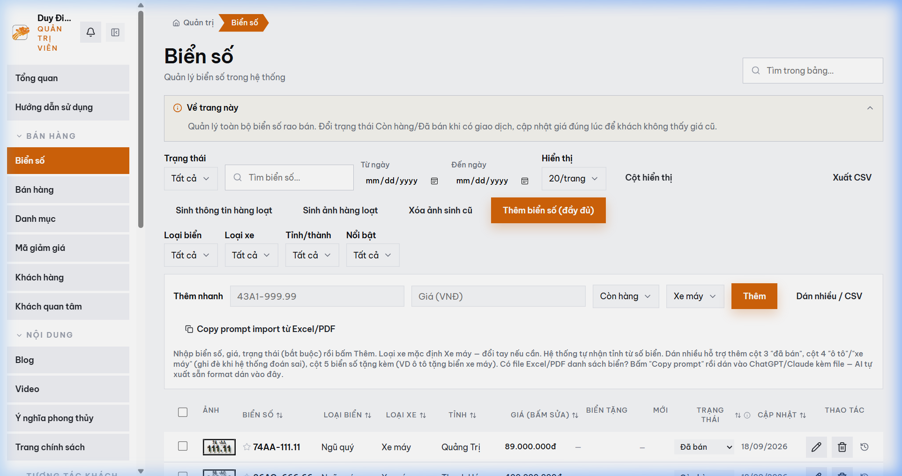

# MODULE 01: PHỄU THU THẬP & PHÂN LUỒNG LEAD TỨC THỜI
> **Giải pháp phần mềm lắp ghép độc quyền — Thuộc hệ sinh thái SynapForge**  
> **Dự án gốc đã triển khai thực tế:** `BienSoVip (Sàn Đấu Giá & Giao Dịch Biển Số Xe)`  
> **Công nghệ cốt lõi:** `Webhook API • Telegram Bot • Zalo Webhook • Redis Cache`  
> **Chỉ số đo lường thực tế:** `Độ trễ phân luồng < 30 giây`  

---

## 1. HÌNH ẢNH MINH CHỨNG THỰC TẾ ĐÃ CODE TRONG SẢN XUẤT
Dưới đây là ảnh chụp màn hình trực tiếp từ hệ thống đang vận hành thực tế:

*Chú thích: Phễu phân tích lead thực tế & định tuyến thông báo Telegram tức thì từ hệ thống Biensovip*

---

## 2. NỖI ĐAU THỰC TẾ CỦA DOANH NGHIỆP (PAIN POINT)
Khách hàng có ý định mua thường tham khảo nhiều nơi cùng lúc. Nếu phản hồi chậm quá 15 phút, tỷ lệ chốt giảm hơn 70%. Hệ thống này tự động phân tích cấp độ nóng của khách và đẩy thông báo thẳng về Telegram / Zalo của chủ shop trong dưới 30 giây để tiếp cận ngay khi khách còn đang trên trang.

---

## 3. GIẢI PHÁP KỸ THUẬT & KIẾN TRÚC SYNAPFORGE (TECHNICAL SOLUTION)
Thiết lập Webhook bắt sự kiện người dùng bấm giữ cọc hoặc điền form tư vấn. Backend chấm điểm ý định mua (Intent Scoring), gắn thẻ phân loại (Hỏi giá, Giữ cọc, Chốt gấp) và bắn thông báo tức thời về thiết bị di động của chủ shop kèm số điện thoại và lịch sử xem sản phẩm.

---

## 4. QUY TRÌNH HOẠT ĐỘNG THỰC TẾ (WORKFLOW)
1. **Bước 1:** Khách hàng tương tác bấm giữ cọc hoặc yêu cầu tư vấn trên trang chi tiết sản phẩm.
2. **Bước 2:** Backend phân tích độ nóng và kích hoạt Webhook bắn thẳng về Telegram/Zalo chủ shop.
3. **Bước 3:** Chủ shop nhận thông báo có đủ số điện thoại và nhu cầu để gọi điện chốt đơn trong dưới 30s.

---

## 5. HƯỚNG DẪN DÀNH CHO LẬP TRÌNH VIÊN KHI CODE TÍNH NĂNG
* **Dữ liệu nguồn:** Đã được cấu hình trong `src/data/pricingAndSaasData.js` với ID `lead_funnel`.
* **Component giao diện:** Có thể tham chiếu component mẫu từ dự án gốc để lắp ráp trực tiếp vào website của khách hàng.
* **Thư mục ảnh assets:** `public/docs/images/biensovip_admin_analytics.png`.
