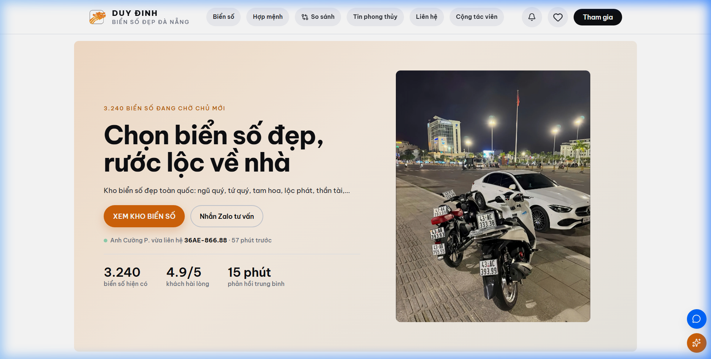

# MODULE 02: THANH TOÁN & ĐỐI SOÁT VIETQR ĐỘNG 0Đ PHÍ CỔNG
> **Giải pháp phần mềm lắp ghép độc quyền — Thuộc hệ sinh thái SynapForge**  
> **Dự án gốc đã triển khai thực tế:** `BienSoVip (Sàn Đấu Giá & Giao Dịch Biển Số Xe)`  
> **Công nghệ cốt lõi:** `VietQR API • Bank Open Webhook • Redis Lock • C# .NET 8`  
> **Chỉ số đo lường thực tế:** `0% Phí cổng trung gian • Khớp cọc dưới 0.5 giây`  

---

## 1. HÌNH ẢNH MINH CHỨNG THỰC TẾ ĐÃ CODE TRONG SẢN XUẤT
Dưới đây là ảnh chụp màn hình trực tiếp từ hệ thống đang vận hành thực tế:

*Chú thích: Cổng cọc VietQR động và luồng đối soát tự động không qua trung gian trên sàn Biensovip.com*

---

## 2. NỖI ĐAU THỰC TẾ CỦA DOANH NGHIỆP (PAIN POINT)
Sử dụng cổng thanh toán bên thứ ba vừa tốn 1.5% - 2.5% phí giao dịch, vừa bị giữ tiền đối soát 3-7 ngày. Nếu yêu cầu khách chuyển khoản thủ công thì nhân viên phải mở app ngân hàng dò từng dòng sao kê rất dễ sót. VietQR động giải quyết triệt để 2 vấn đề này với 0đ phí cổng.

---

## 3. GIẢI PHÁP KỸ THUẬT & KIẾN TRÚC SYNAPFORGE (TECHNICAL SOLUTION)
Sinh mã QR động nhúng chính xác số tiền và mã giao dịch định danh duy nhất (ví dụ: BSV 12345). Khi khách quét mã chuyển tiền từ bất kỳ app ngân hàng nào, Webhook ngân hàng bắn tín hiệu khớp lệnh trong 0.5s, tự động đổi trạng thái đơn sang ĐÃ CỌC và xuất biên lai PDF.

---

## 4. QUY TRÌNH HOẠT ĐỘNG THỰC TẾ (WORKFLOW)
1. **Bước 1:** Hệ thống sinh mã VietQR động chứa chính xác số tiền cọc và mã đơn hàng.
2. **Bước 2:** Khách quét mã bằng app ngân hàng bất kỳ, Webhook ngân hàng xác thực giao dịch < 0.5s.
3. **Bước 3:** Đơn hàng tự động chuyển sang trạng thái ĐÃ CỌC, kho hàng khóa sản phẩm và gửi biên lai PDF.

---

## 5. HƯỚNG DẪN DÀNH CHO LẬP TRÌNH VIÊN KHI CODE TÍNH NĂNG
* **Dữ liệu nguồn:** Đã được cấu hình trong `src/data/pricingAndSaasData.js` với ID `vietqr_reconcile`.
* **Component giao diện:** Có thể tham chiếu component mẫu từ dự án gốc để lắp ráp trực tiếp vào website của khách hàng.
* **Thư mục ảnh assets:** `public/docs/images/biensovip_home_real.png`.
