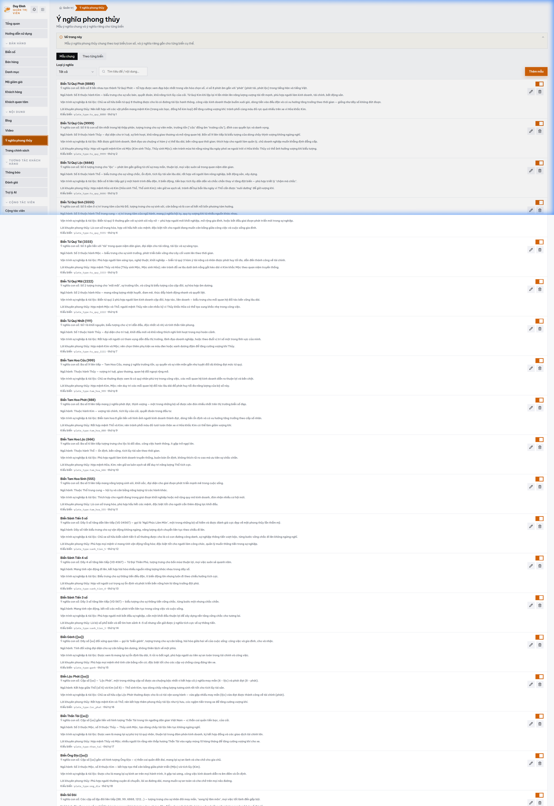

# MODULE 04: TRỢ LÝ AI CSKH & TƯ VẤN PHONG THỦY TỰ ĐỘNG 24/7
> **Giải pháp phần mềm lắp ghép độc quyền — Thuộc hệ sinh thái SynapForge**  
> **Dự án gốc đã triển khai thực tế:** `BienSoVip (Sàn Đấu Giá & Giao Dịch Biển Số Xe)`  
> **Công nghệ cốt lõi:** `DeepSeek API • OpenAI GPT-4o • Vector Store • Python FastAPI`  
> **Chỉ số đo lường thực tế:** `Tương tác 24/7 • Phản hồi < 2 giây • Am hiểu 100% kho dữ liệu`  

---

## 1. HÌNH ẢNH MINH CHỨNG THỰC TẾ ĐÃ CODE TRONG SẢN XUẤT
Dưới đây là ảnh chụp màn hình trực tiếp từ hệ thống đang vận hành thực tế:

*Chú thích: Giao diện trợ lý AI am hiểu kho dữ liệu biển số và tra cứu phong thủy tự động*

---

## 2. NỖI ĐAU THỰC TẾ CỦA DOANH NGHIỆP (PAIN POINT)
Khách hàng thường mua sắm vào ban đêm (21h - 24h) và cuối tuần, thời điểm nhân viên tư vấn đã nghỉ làm. Khách hàng hỏi giá hoặc xin tư vấn phong thủy không được phản hồi sẽ lập tức rời sang đối thủ.

---

## 3. GIẢI PHÁP KỸ THUẬT & KIẾN TRÚC SYNAPFORGE (TECHNICAL SOLUTION)
Tích hợp trợ lý ảo AI được huấn luyện trên kho dữ liệu sản phẩm, thông số phong thủy ngũ hành và chính sách giá. AI có khả năng trò chuyện tự nhiên, giải thích ý nghĩa số học và tự động chốt lịch hẹn tư vấn cho nhân viên vào sáng hôm sau.

---

## 4. QUY TRÌNH HOẠT ĐỘNG THỰC TẾ (WORKFLOW)
1. **Bước 1:** Khách hàng nhập câu hỏi hoặc ngày tháng năm sinh vào khung chat AI trên website.
2. **Bước 2:** AI đối chiếu kho dữ liệu thực tế và thuật toán Bát Tự để gợi ý sản phẩm phù hợp nhất.
3. **Bước 3:** AI xin số điện thoại khách hàng và gửi thông báo trực tiếp về nhóm Telegram quản lý.

---

## 5. HƯỚNG DẪN DÀNH CHO LẬP TRÌNH VIÊN KHI CODE TÍNH NĂNG
* **Dữ liệu nguồn:** Đã được cấu hình trong `src/data/pricingAndSaasData.js` với ID `ai_advisory`.
* **Component giao diện:** Có thể tham chiếu component mẫu từ dự án gốc để lắp ráp trực tiếp vào website của khách hàng.
* **Thư mục ảnh assets:** `public/docs/images/biensovip_real_fengshui.png`.
