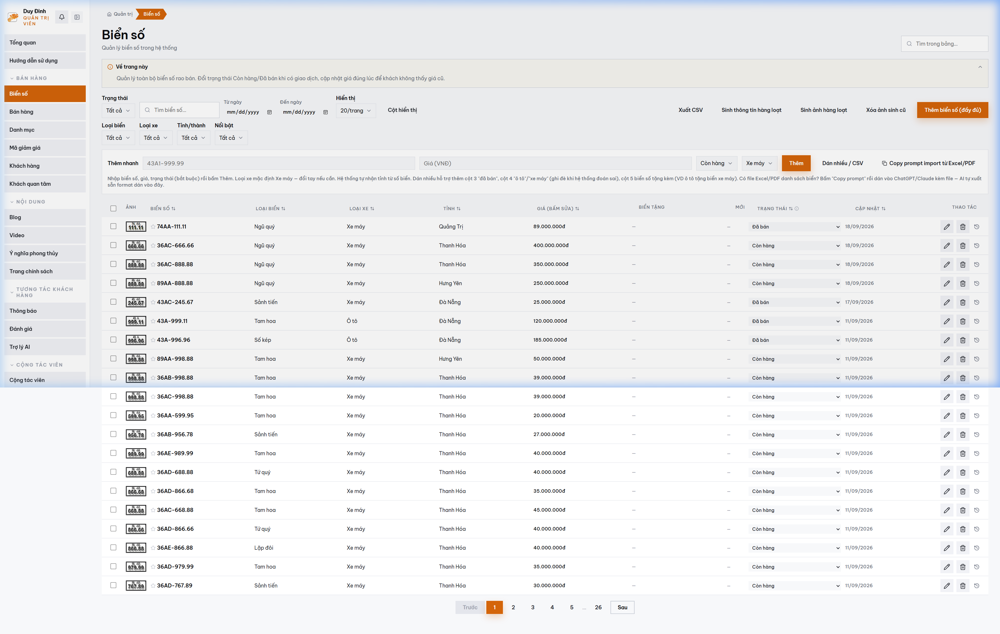

# MODULE 05: CÔNG CỤ TỰ ĐỘNG SINH ẢNH MOCKUP TIẾP THỊ ĐA TỶ LỆ
> **Giải pháp phần mềm lắp ghép độc quyền — Thuộc hệ sinh thái SynapForge**  
> **Dự án gốc đã triển khai thực tế:** `BienSoVip (Sàn Đấu Giá & Giao Dịch Biển Số Xe)`  
> **Công nghệ cốt lõi:** `Canvas API • Sharp.js • Cloudinary Image Transformations`  
> **Chỉ số đo lường thực tế:** `1-Click Render hàng loạt • Chuẩn khung hình 1:1, 16:9, 9:16`  

---

## 1. HÌNH ẢNH MINH CHỨNG THỰC TẾ ĐÃ CODE TRONG SẢN XUẤT
Dưới đây là ảnh chụp màn hình trực tiếp từ hệ thống đang vận hành thực tế:

*Chú thích: Công cụ quản trị kho tích hợp render hàng loạt ảnh mockup sản phẩm thực tế*

---

## 2. NỖI ĐAU THỰC TẾ CỦA DOANH NGHIỆP (PAIN POINT)
Mỗi khi nhập hàng mới, chủ shop hoặc designer phải mất hàng giờ dùng Photoshop để ghép sản phẩm vào phông nền, xuất từng kích thước vuông cho Facebook, dọc cho Story/TikTok.

---

## 3. GIẢI PHÁP KỸ THUẬT & KIẾN TRÚC SYNAPFORGE (TECHNICAL SOLUTION)
Tích hợp động cơ sinh ảnh tự động trong trang Admin. Quản trị viên chỉ cần chọn sản phẩm, bấm 1 nút là hệ thống tự động render ảnh sản phẩm gắn lên đuôi các dòng xe sang (Mercedes, Porsche, Range Rover...) chuẩn tỷ lệ MXH sẵn sàng đăng bài.

---

## 4. QUY TRÌNH HOẠT ĐỘNG THỰC TẾ (WORKFLOW)
1. **Bước 1:** Quản trị viên chọn danh sách sản phẩm cần quảng bá trong bảng điều khiển Admin.
2. **Bước 2:** Bấm 'Sinh ảnh Mockup', server tự động ghép phôi biển số lên ảnh xe mẫu cao cấp.
3. **Bước 3:** Tự động tải về file nén Zip hoặc đẩy thẳng lên thư viện bài đăng mạng xã hội.

---

## 5. HƯỚNG DẪN DÀNH CHO LẬP TRÌNH VIÊN KHI CODE TÍNH NĂNG
* **Dữ liệu nguồn:** Đã được cấu hình trong `src/data/pricingAndSaasData.js` với ID `mockup_gen`.
* **Component giao diện:** Có thể tham chiếu component mẫu từ dự án gốc để lắp ráp trực tiếp vào website của khách hàng.
* **Thư mục ảnh assets:** `public/docs/images/biensovip_real_plates.png`.
