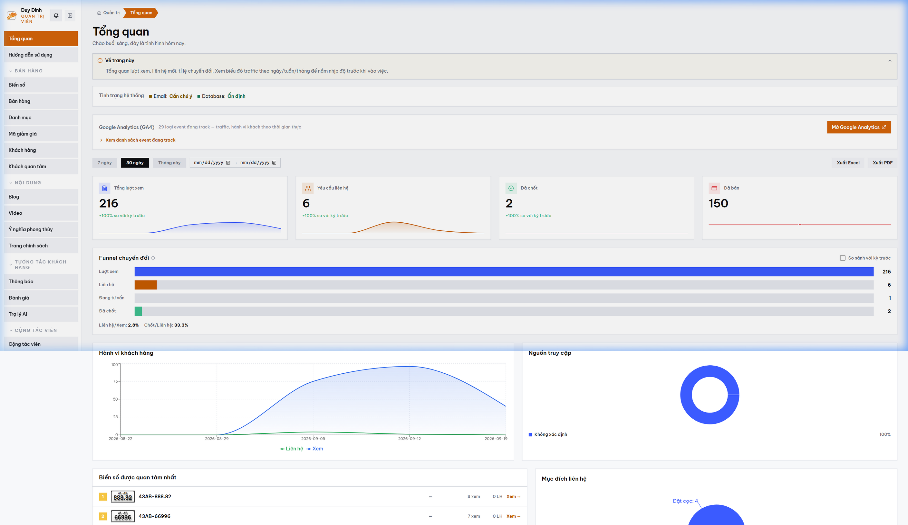

# MODULE 06: EMAIL MARKETING KÉO-THẢ & LUỒNG CHĂM SÓC HẬU MÃI (UC27)
> **Giải pháp phần mềm lắp ghép độc quyền — Thuộc hệ sinh thái SynapForge**  
> **Dự án gốc đã triển khai thực tế:** `BienSoVip (Sàn Đấu Giá & Giao Dịch Biển Số Xe)`  
> **Công nghệ cốt lõi:** `Visual Drag & Drop Email Designer • Private SMTP • AWS SES • ClosedXML`  
> **Chỉ số đo lường thực tế:** `0đ Phí dịch vụ hàng tháng • Tự động gửi hóa đơn & biên lai PDF`  

---

## 1. HÌNH ẢNH MINH CHỨNG THỰC TẾ ĐÃ CODE TRONG SẢN XUẤT
Dưới đây là ảnh chụp màn hình trực tiếp từ hệ thống đang vận hành thực tế:

*Chú thích: Bảng điều khiển quản trị tích hợp luồng chăm sóc email tự động và báo cáo chốt cọc*

---

## 2. NỖI ĐAU THỰC TẾ CỦA DOANH NGHIỆP (PAIN POINT)
Các dịch vụ gửi email marketing như Mailchimp hay SendGrid thu phí đắt đỏ theo số lượng contact hàng tháng. Template dựng sẵn khó đồng bộ với dữ liệu đơn hàng và khó đính kèm hóa đơn điện tử.

---

## 3. GIẢI PHÁP KỸ THUẬT & KIẾN TRÚC SYNAPFORGE (TECHNICAL SOLUTION)
Tích hợp trình thiết kế email kéo thả trực tiếp trong Admin, kết nối qua máy chủ SMTP doanh nghiệp riêng với chi phí 0đ. Tự động kích hoạt chuỗi email: Xác nhận đơn cọc, hướng dẫn nhận bàn giao và chúc mừng sinh nhật khách hàng.

---

## 4. QUY TRÌNH HOẠT ĐỘNG THỰC TẾ (WORKFLOW)
1. **Bước 1:** Admin tạo mẫu email bằng giao diện kéo thả trực quan (ảnh, nút bấm, chữ ký số).
2. **Bước 2:** Giao dịch phát sinh -> Hệ thống tự động sinh hóa đơn PDF và gửi email cho khách.
3. **Bước 3:** Theo dõi tỷ lệ mở email và tỷ lệ nhấp chuột vào link trực tiếp trên Dashboard.

---

## 5. HƯỚNG DẪN DÀNH CHO LẬP TRÌNH VIÊN KHI CODE TÍNH NĂNG
* **Dữ liệu nguồn:** Đã được cấu hình trong `src/data/pricingAndSaasData.js` với ID `email_builder`.
* **Component giao diện:** Có thể tham chiếu component mẫu từ dự án gốc để lắp ráp trực tiếp vào website của khách hàng.
* **Thư mục ảnh assets:** `public/docs/images/biensovip_real_dashboard.png`.
