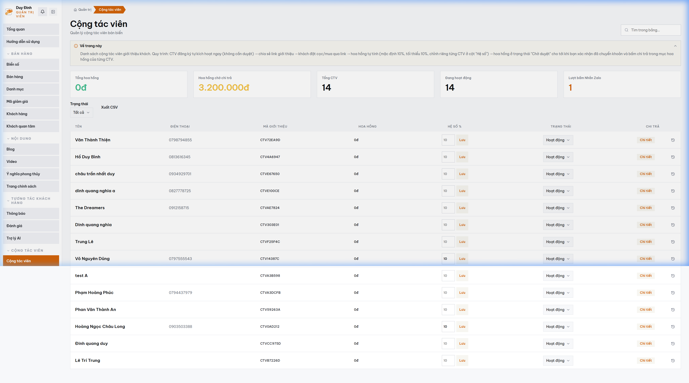

# MODULE 07: CỔNG MẠNG LƯỚI CỘNG TÁC VIÊN (CTV) & VÍ HOA HỒNG TỰ ĐỘNG
> **Giải pháp phần mềm lắp ghép độc quyền — Thuộc hệ sinh thái SynapForge**  
> **Dự án gốc đã triển khai thực tế:** `BienSoVip (Sàn Đấu Giá & Giao Dịch Biển Số Xe)`  
> **Công nghệ cốt lõi:** `UTM Attribution Engine • Digital Wallet Ledger • ASP.NET Core • React 19`  
> **Chỉ số đo lường thực tế:** `14 Môi giới đang hoạt động • Tự động ghi nhận hoa hồng • Duyệt chi 1-click`  

---

## 1. HÌNH ẢNH MINH CHỨNG THỰC TẾ ĐÃ CODE TRONG SẢN XUẤT
Dưới đây là ảnh chụp màn hình trực tiếp từ hệ thống đang vận hành thực tế:

*Chú thích: Giao diện quản trị 14 Cộng Tác Viên (CTV) và cấp link UTM định danh trên Biensovip*

---

## 2. NỖI ĐAU THỰC TẾ CỦA DOANH NGHIỆP (PAIN POINT)
Mở rộng mạng lưới cộng tác viên bán hàng thường gặp khó khăn trong việc ghi nhận nguồn khách: CTV tranh chấp khách của nhau, kế toán phải tính hoa hồng thủ công bằng Excel rất dễ nhầm lẫn và thiếu minh bạch.

---

## 3. GIẢI PHÁP KỸ THUẬT & KIẾN TRÚC SYNAPFORGE (TECHNICAL SOLUTION)
Cung cấp cổng Portal riêng cho từng CTV. Mỗi CTV được cấp link chia sẻ có gắn mã định danh UTM riêng biệt. Khi khách hàng bấm link và chốt cọc, hệ thống tự động cộng tiền hoa hồng vào ví CTV, cho phép CTV đặt lệnh rút tiền và admin duyệt 1-click.

---

## 4. QUY TRÌNH HOẠT ĐỘNG THỰC TẾ (WORKFLOW)
1. **Bước 1:** CTV đăng nhập portal, lấy link giới thiệu sản phẩm có gắn mã UTM cá nhân.
2. **Bước 2:** Khách hàng bấm link duyệt web và đặt cọc thành công -> Ví CTV tự động nhảy số dư.
3. **Bước 3:** CTV gửi yêu cầu rút tiền -> Admin kiểm tra và duyệt thanh toán trực tiếp qua VietQR.

---

## 5. HƯỚNG DẪN DÀNH CHO LẬP TRÌNH VIÊN KHI CODE TÍNH NĂNG
* **Dữ liệu nguồn:** Đã được cấu hình trong `src/data/pricingAndSaasData.js` với ID `ctv_portal`.
* **Component giao diện:** Có thể tham chiếu component mẫu từ dự án gốc để lắp ráp trực tiếp vào website của khách hàng.
* **Thư mục ảnh assets:** `public/docs/images/biensovip_real_ctv.png`.
