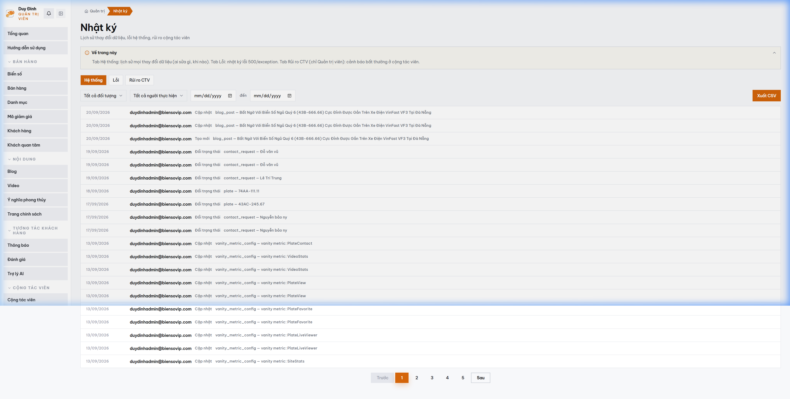

# MODULE 08: BẢO MẬT CHỐNG THẤT THOÁT DỮ LIỆU KHÁCH VIP & NHẬT KÝ KIỂM TOÁN
> **Giải pháp phần mềm lắp ghép độc quyền — Thuộc hệ sinh thái SynapForge**  
> **Dự án gốc đã triển khai thực tế:** `BienSoVip (Sàn Đấu Giá & Giao Dịch Biển Số Xe)`  
> **Công nghệ cốt lõi:** `Immutable Audit Trail • Masked PII Data • Role-Based Access Control (RBAC)`  
> **Chỉ số đo lường thực tế:** `Kiểm toán 100% thao tác • Ẩn số điện thoại khách VIP • Chuẩn bảo mật doanh nghiệp`  

---

## 1. HÌNH ẢNH MINH CHỨNG THỰC TẾ ĐÃ CODE TRONG SẢN XUẤT
Dưới đây là ảnh chụp màn hình trực tiếp từ hệ thống đang vận hành thực tế:

*Chú thích: Nhật ký kiểm toán hệ thống bất biến (Audit Trail) giám sát an ninh dữ liệu Biensovip*

---

## 2. NỖI ĐAU THỰC TẾ CỦA DOANH NGHIỆP (PAIN POINT)
Nhân viên kinh doanh hoặc quản trị viên có thể lén chụp màn hình hoặc xuất danh sách khách hàng VIP mang sang đối thủ, gây thiệt hại nghiêm trọng cho doanh nghiệp.

---

## 3. GIẢI PHÁP KỸ THUẬT & KIẾN TRÚC SYNAPFORGE (TECHNICAL SOLUTION)
Ẩn số điện thoại và thông tin cá nhân của khách hàng (chỉ hiển thị dưới dạng `0912***715`). Mọi hành vi bấm 'Hiện số điện thoại', sửa giá hay xóa dữ liệu đều bị ghi vào sổ nhật ký kiểm toán bất biến (Audit Trail) kèm IP, thời gian và ID nhân viên.

---

## 4. QUY TRÌNH HOẠT ĐỘNG THỰC TẾ (WORKFLOW)
1. **Bước 1:** Nhân viên muốn xem số điện thoại khách hàng phải bấm nút 'Mở khóa thông tin'.
2. **Bước 2:** Hệ thống ghi nhận sự kiện mở khóa vào bảng Audit Log lưu trữ độc lập.
3. **Bước 3:** Admin nhận cảnh báo tức thời nếu một tài khoản mở khóa hàng loạt dữ liệu bất thường.

---

## 5. HƯỚNG DẪN DÀNH CHO LẬP TRÌNH VIÊN KHI CODE TÍNH NĂNG
* **Dữ liệu nguồn:** Đã được cấu hình trong `src/data/pricingAndSaasData.js` với ID `audit_security`.
* **Component giao diện:** Có thể tham chiếu component mẫu từ dự án gốc để lắp ráp trực tiếp vào website của khách hàng.
* **Thư mục ảnh assets:** `public/docs/images/biensovip_real_audit.png`.
