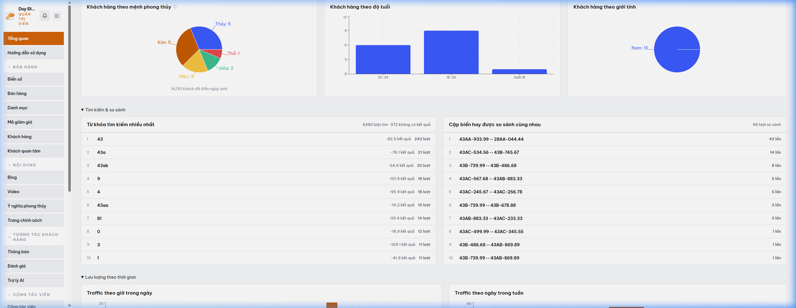

# MODULE 10: MA TRẬN SO SÁNH ĐA SẢN PHẨM SONG SONG & NHÚNG VIDEO CLIP
> **Giải pháp phần mềm lắp ghép độc quyền — Thuộc hệ sinh thái SynapForge**  
> **Dự án gốc đã triển khai thực tế:** `BienSoVip (Sàn Đấu Giá & Giao Dịch Biển Số Xe)`  
> **Công nghệ cốt lõi:** `Comparison Matrix Engine • TikTok / Reels Video Embedder • LocalStorage Sync`  
> **Chỉ số đo lường thực tế:** `Đối chiếu 3 sản phẩm song song • Tăng 35% tỷ lệ chốt đơn (Conversion Rate)`  

---

## 1. HÌNH ẢNH MINH CHỨNG THỰC TẾ ĐÃ CODE TRONG SẢN XUẤT
Dưới đây là ảnh chụp màn hình trực tiếp từ hệ thống đang vận hành thực tế:

*Chú thích: Bảng ma trận so sánh đa biển số song song và nhúng video thực tế trên Biensovip*

---

## 2. NỖI ĐAU THỰC TẾ CỦA DOANH NGHIỆP (PAIN POINT)
Khách hàng phân vân giữa 2–3 lựa chọn có mức giá gần nhau nhưng phải mở nhiều tab trình duyệt qua lại rất bất tiện, dễ gây nản lòng và từ bỏ ý định mua hàng.

---

## 3. GIẢI PHÁP KỸ THUẬT & KIẾN TRÚC SYNAPFORGE (TECHNICAL SOLUTION)
Cho phép khách hàng bấm 'Thêm vào so sánh'. Hệ thống hiển thị bảng đối chiếu trực quan 3 sản phẩm song song trên cùng một màn hình (giá bán, đặc tính kỹ thuật, điểm phong thủy) kèm video review thực tế nhúng từ TikTok/Reels.

---

## 4. QUY TRÌNH HOẠT ĐỘNG THỰC TẾ (WORKFLOW)
1. **Bước 1:** Khách hàng tích chọn 2 đến 3 sản phẩm đang phân vân trong danh mục.
2. **Bước 2:** Bảng so sánh xuất hiện đối chiếu từng thông số, làm nổi bật điểm vượt trội.
3. **Bước 3:** Khách xem video thực tế đính kèm và đưa ra quyết định đặt cọc nhanh chóng.

---

## 5. HƯỚNG DẪN DÀNH CHO LẬP TRÌNH VIÊN KHI CODE TÍNH NĂNG
* **Dữ liệu nguồn:** Đã được cấu hình trong `src/data/pricingAndSaasData.js` với ID `comparison_social`.
* **Component giao diện:** Có thể tham chiếu component mẫu từ dự án gốc để lắp ráp trực tiếp vào website của khách hàng.
* **Thư mục ảnh assets:** `public/docs/images/biensovip_real_comparison.png`.
