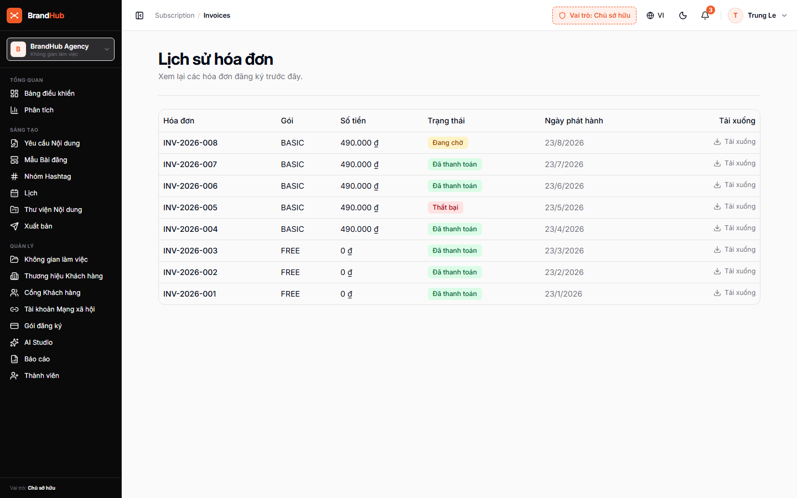

# MODULE 11: XUẤT BẢN TỰ ĐỘNG ĐA KÊNH MẠNG XÃ HỘI VỚI RABBITMQ DLQ
> **Giải pháp phần mềm lắp ghép độc quyền — Thuộc hệ sinh thái SynapForge**  
> **Dự án gốc đã triển khai thực tế:** `BrandHub (Nền Tảng Trí Tuệ Thương Hiệu & Xuất Bản Đa Kênh)`  
> **Công nghệ cốt lõi:** `RabbitMQ Dead Letter Queue (DLQ) • Spring Boot 3 • Social Graph APIs`  
> **Chỉ số đo lường thực tế:** `Đồng bộ 5 mạng xã hội • Cam kết 0% tỷ lệ rớt tin nhắn xuất bản`  

---

## 1. HÌNH ẢNH MINH CHỨNG THỰC TẾ ĐÃ CODE TRONG SẢN XUẤT
Dưới đây là ảnh chụp màn hình trực tiếp từ hệ thống đang vận hành thực tế:

*Chú thích: Lịch biểu xuất bản tự động đa nền tảng kết nối hàng đợi RabbitMQ từ BrandHub*

---

## 2. NỖI ĐAU THỰC TẾ CỦA DOANH NGHIỆP (PAIN POINT)
Đăng bài thủ công lên 5 mạng xã hội (Facebook, TikTok, Instagram, Threads, Zalo) tốn nhiều nhân lực, dễ sai lệch múi giờ và khi mạng lỗi thì bài đăng bị mất luôn mà không hề có cảnh báo.

---

## 3. GIẢI PHÁP KỸ THUẬT & KIẾN TRÚC SYNAPFORGE (TECHNICAL SOLUTION)
Xây dựng microservice xuất bản bất đồng bộ qua RabbitMQ Task Queue. Áp dụng cơ chế Dead Letter Queue (DLQ) tự động thử lại sau 5s, 15s, 45s nếu mạng chập chờn, bảo đảm 100% bài viết được xuất bản đúng hẹn mà không nghẽn server.

---

## 4. QUY TRÌNH HOẠT ĐỘNG THỰC TẾ (WORKFLOW)
1. **Bước 1:** Người dùng soạn bài viết và chọn các mạng xã hội cần đăng kèm lịch hẹn giờ.
2. **Bước 2:** Hệ thống đẩy tác vụ vào RabbitMQ, công nhân (Worker) xử lý xuất bản song song.
3. **Bước 3:** Nếu gặp lỗi mạng -> Tự động chuyển vào hàng đợi thử lại cho đến khi thành công.

---

## 5. HƯỚNG DẪN DÀNH CHO LẬP TRÌNH VIÊN KHI CODE TÍNH NĂNG
* **Dữ liệu nguồn:** Đã được cấu hình trong `src/data/pricingAndSaasData.js` với ID `omnichannel_publisher`.
* **Component giao diện:** Có thể tham chiếu component mẫu từ dự án gốc để lắp ráp trực tiếp vào website của khách hàng.
* **Thư mục ảnh assets:** `public/docs/images/DA-D19-03.png`.
