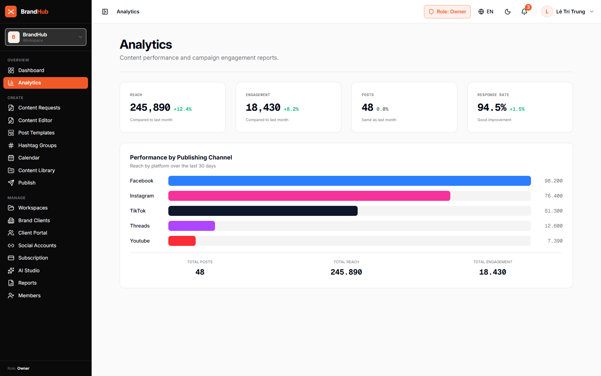

# MODULE 13: PHÂN QUYỀN LÀM VIỆC ĐA TẦNG (MULTI-TENANT RBAC) & KIỂM SOÁT HẠN MỨC
> **Giải pháp phần mềm lắp ghép độc quyền — Thuộc hệ sinh thái SynapForge**  
> **Dự án gốc đã triển khai thực tế:** `BrandHub (Nền Tảng Trí Tuệ Thương Hiệu & Xuất Bản Đa Kênh)`  
> **Công nghệ cốt lõi:** `Spring Cloud Gateway • Distributed JWT • Redis Token Bucket • Multi-Tenancy`  
> **Chỉ số đo lường thực tế:** `Phân quyền Agency / Brand / CTV • Bảo vệ an toàn dữ liệu khách hàng`  

---

## 1. HÌNH ẢNH MINH CHỨNG THỰC TẾ ĐÃ CODE TRONG SẢN XUẤT
Dưới đây là ảnh chụp màn hình trực tiếp từ hệ thống đang vận hành thực tế:

*Chú thích: Mô hình phân quyền tổ chức đa cấp Multi-Tenant và quản lý hạn mức trên BrandHub*

---

## 2. NỖI ĐAU THỰC TẾ CỦA DOANH NGHIỆP (PAIN POINT)
Khi doanh nghiệp mở rộng quy mô, nhiều bộ phận và đối tác ngoài cùng truy cập hệ thống rất dễ xảy ra xung đột dữ liệu, lộ thông tin nội bộ hoặc vượt quá hạn mức tài nguyên máy chủ.

---

## 3. GIẢI PHÁP KỸ THUẬT & KIẾN TRÚC SYNAPFORGE (TECHNICAL SOLUTION)
Kiến trúc Multi-tenancy phân tách không gian làm việc độc lập giữa Agency quản lý, Khách hàng sở hữu thương hiệu và CTV viết bài. Phân quyền chi tiết từng chức năng (chỉ xem, được soạn thảo, duyệt bài, xuất bản) và kiểm soát hạn mức lưu trữ.

---

## 4. QUY TRÌNH HOẠT ĐỘNG THỰC TẾ (WORKFLOW)
1. **Bước 1:** Quản lý tạo thương hiệu con và gán quyền cho từng thành viên trong nhóm.
2. **Bước 2:** Từng thành viên chỉ truy cập được đúng tài nguyên và tính năng được cấp phép.
3. **Bước 3:** Hệ thống tự động theo dõi hạn mức sử dụng (số bài viết, dung lượng media, số lượng tài khoản).

---

## 5. HƯỚNG DẪN DÀNH CHO LẬP TRÌNH VIÊN KHI CODE TÍNH NĂNG
* **Dữ liệu nguồn:** Đã được cấu hình trong `src/data/pricingAndSaasData.js` với ID `multitenant_rbac`.
* **Component giao diện:** Có thể tham chiếu component mẫu từ dự án gốc để lắp ráp trực tiếp vào website của khách hàng.
* **Thư mục ảnh assets:** `public/docs/images/DA-D19-06.png`.
